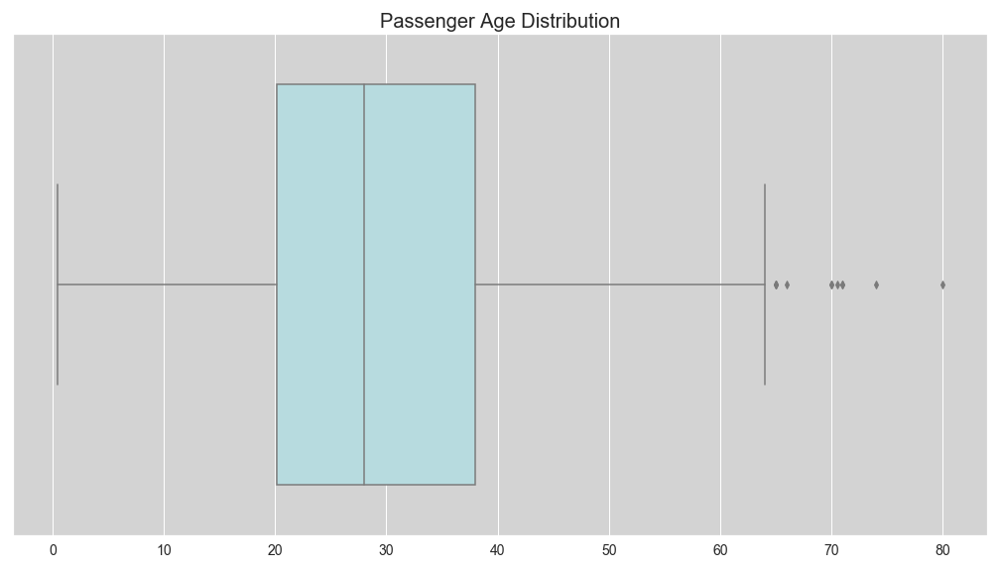
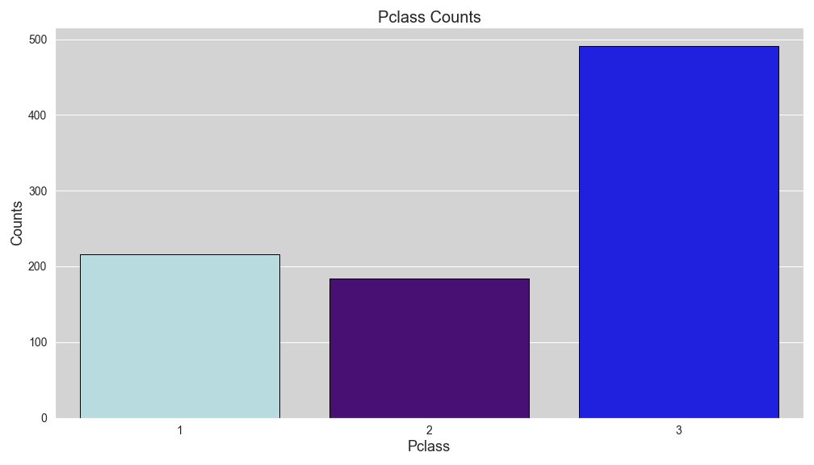
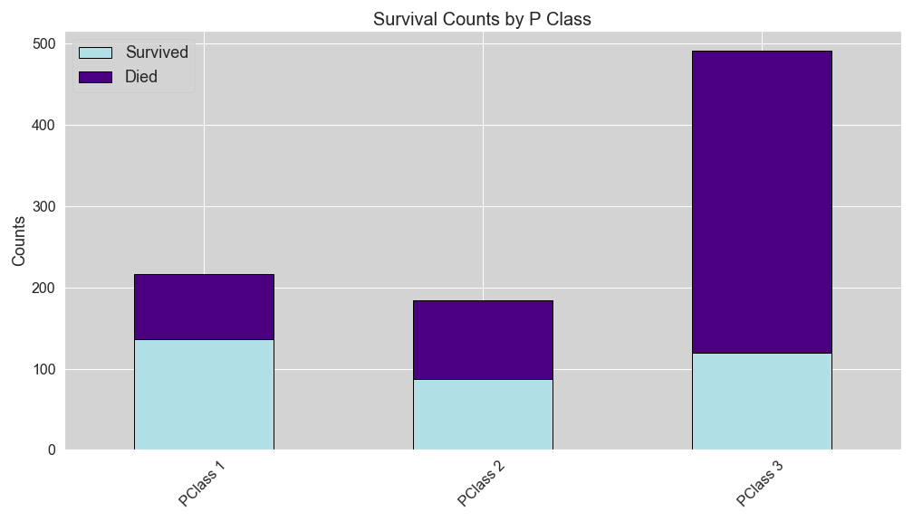
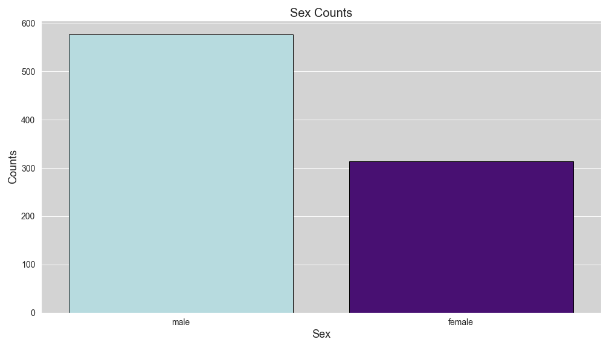

# Titanic Kaggle Competition

## Objective

The objective of this project is to create a machine learning model to predict which passengers survived during the Titanic shipwreck. The project will be submitted to Kaggle for the "Titanic: Machine Learning from Disaster" competition. 

## The Data

The data has been selected by Kaggle, and is split into a training set and a test set. Each set contains the following features:

* Passenger ID: unique, auto incremented ID for all passengers
* Survived: 1 = Survived, 0 = Died
* Pclass: Passenger class description
* Name: Passenger name, including prefixes, and sometimes, nicknames
* Sex: Male of Female
* Age: Age of passenger
* SibSp: Number of siblings/spouses aboard
* Parch: Number of parents/children aboard
* Ticket: Ticket number
* Fare: Passenger fare
* Cabin: Cabin identification
* Embarked: Port of embarkation (C = Cherbourg; Q = Queenstown; S = Southampton)

## Visualizations

