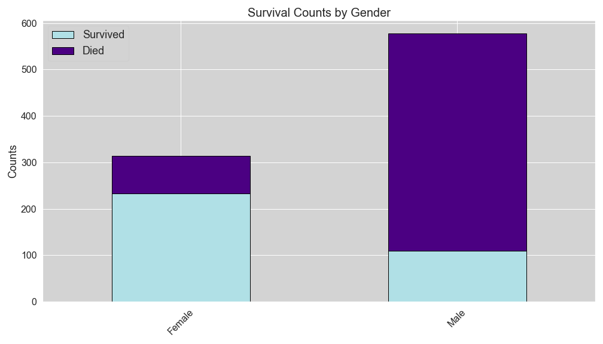
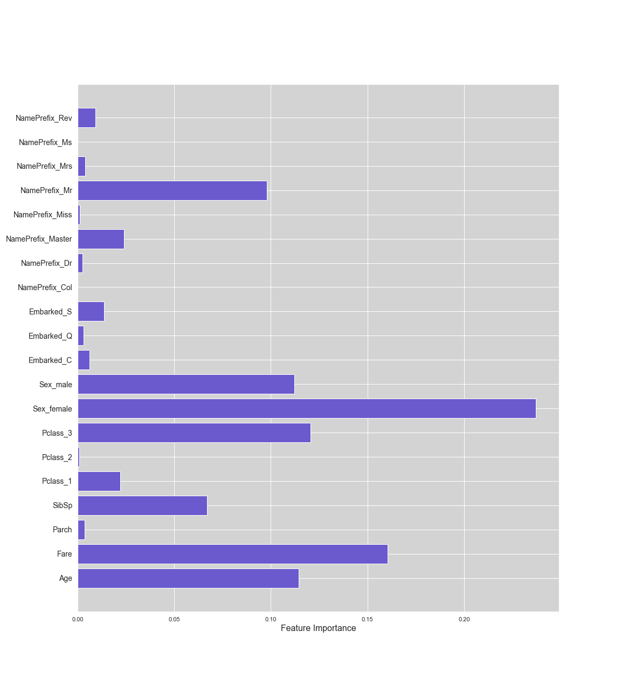

# Titanic Kaggle Competition

## Objective

The objective of this project is to create a machine learning model to predict which passengers survived during the Titanic shipwreck. The project will be submitted to Kaggle for the "Titanic: Machine Learning from Disaster" competition. 

## The Data

The data has been selected by Kaggle, and is split into a training set and a test set. Each set contains the following features:

* Passenger ID: unique, auto incremented ID for all passengers
* Survived: 1 = Survived, 0 = Died
* Pclass: Passenger class description
* Name: Passenger name, including prefixes, and sometimes, nicknames
* Sex: Male of Female
* Age: Age of passenger
* SibSp: Number of siblings/spouses aboard
* Parch: Number of parents/children aboard
* Ticket: Ticket number
* Fare: Passenger fare
* Cabin: Cabin identification
* Embarked: Port of embarkation (C = Cherbourg; Q = Queenstown; S = Southampton)

## Handling Missing Data

Age was missing 177/891 values. It was assumed to be an important feature, and so this missing values were handled as so. The prefix of every passengers name was extracted, for example, Miss, Mr and Mrs, and the average age was calculated for each of these prefixes. The average age per prefix was used to fill in the missing age values according to the passengers prefix. 

Cabin was missing 687/891 values, and since there were too many unique values to be useful, this feature column was dropped. 

## Visualizations

## Results

The following models were evaluated via F1 Score:

* Random Forest Classifier
* Gradient Boosting Classifier
* XGBoost Classifier
* Extra Trees Classifier
* Bagging Classifier

Without hyperparameter tuning, the highest F1 score, 0.82, was produced by the Gradient Boosting Classifier, with the following feature importance plot:

